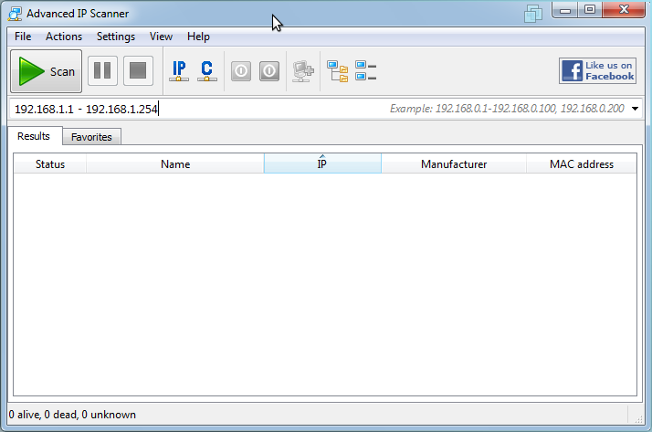

#Raspberry Pi: A Guide for the Gifted#
##Contents
###[Prefatory Matter](#prefatory_matter)
1. License and Copyright
2. Not so Cryptic (for the print edition)
3. Target Audience
4. Work in Progress (and To Do list)
###Getting Started
5. Taking Stock
6. Preventative Maintenance: The Case for a Case
7. Cases and Cases
8. Preparation
9. System Configuration
10. Command Line and Graphical User Interfaces
11. User Administration
12. Remote Computing

###[Appendices](#appendices-1)
13. Projects
14. Of Mohawk Guy and Raspberry Pi
15. Additional Reading

##Prefatory Matter

###Nearly free to Share, Nearly Free to Remix 

This work is licensed under a [Creative Commons 
Attribution-NonCommercial-ShareAlike 3.0 Unported License](http://creativecommons.org/licenses/by-nc-sa/3.0/deed.en_US). 

Copyright 2012 by Rik Goldman and Sabre Goldman 

###Not so Cryptic 

If you know about QR codes, move along to the next 
bits. 

QR stands for quick response. Like a bar code, it's meant to make 
information easily accessible for processing - by human or machine. 

We take a cue here from innovative educators looking for ways 
to deliver a personal, multimedia-rich reading experience 
to our school age-childen. 

With a QR code, I can convey a set of instructions, supplemental 
materials, bits of code - some extraordinary amounts of information 
in less than 100 square pixels. The code on this page is intended 
to provide some insight into the design decisions that had to 
be made to create and deliver the Raspberry Pi. It's a video introduction 
from Cambridge given by Eben Upton, Raspberry Pi's lead developer. 
Via YouTube, Upton offers a short description of the device and 
the intentions that informed its design. 

Could we get along without? Surely. We aren't naive enough to 
believe this will revolutionize print. We fell for that once 
in the 1990s when "hypertext" seemed capable of so much. 

To benefit from QR codes, we need a device capable of decoding 
them. Smart phones with cameras come immediately to mind: apps 
are available for iOS and Android phones to both decode and generate 
QR codes. We can also generate QR codes at various sites around 
the web or from our PCs, if we install the right free software. 

Once you download a capable app up to your phone, launch it and 
point your camera at a QR code; when it manages to get a lock on the 
code, it should process the information and deliver it in the 
best way it's been taught. 

###Target Audience

This book is intended for loved ones who have received Raspberry 
Pis as gifts, expressed their appreciately kindly, and later 
though they have never been understood properly and this is 
just another example, thank you. 

It's intended for readers who browse and search the Web with some 
degree of confidence, predominantly, with success. It's for 
readers who aren't uncomfortable with the choice to "save" or 
"save as." When things get rolling, we stop to work through dealing 
with compressed files with Winzip or Winrar. But really, we expect 
readers to be comfortable with such utilities. 

This is not for readers with vast repositories of disposable 
income: What we try to do is done with finesse and ease in [books](../reading) 
already available for the Raspberry Pi. If it helps, the draft 
title involved, at different points, the words _penurious_ 
and _thrifty_. At every turn we're looking for ways to assure 
ourselves and our readers that the $35 price point of the Raspberry 
Pi isn't ridiculously misleading. On the contrary, we find that 
hacking is just a few dollars away for readers with home networks. 

###Work in Progress

This work isn't finished. At the rate people are innovating with 
and around this technology, it never will be. 

To do: 

* Articulated projects list 

* Tutorials for Mortals (including xbmc, SSH tunneling) 

* Raspberry Pi operating systems 

* Operating System Fundamentals 

* Alternatives to Raspbian 

* Installing Software 

* Appendix: Raspberry Pi Resources 

##Preface
###It's the New Black
The Raspberry Pi is a credit-card sized, $35 computer produced 
in the UK by a non-profit foundation committed to reforming computer 
science and engineering for school-age children. 

However, because of its extensibility, price-point, 
and flexibility, Raspberry Pi proved an international favorite 
of creative hackers and makers since its initial release in March 
of 2012. In fact, at a December talk in DC, product representative 
and engineer Rob Bishop announced that the Raspberry Pi foundation 
anticipated a million sales by March 2013; in the first week of 
December 2012, a tweet from the Raspberry Foundation indicated 
that 800,000 units had already been sold. 

###Compelling Reading, Too
Not only does the Raspberry Pi promote programming and engineering, 
it also gets people to read. Two Raspberry Pi books have impressively 
high Amazon rankings in the UK and the US. 

_Programming the Raspberry Pi: Getting Started with Python_ 
by Simon Monk (2012) 

In the UK, as of mid-December: 

* First in Higher Education of Engineering 

* First in Electronics Engineering 

* First in Engineering Teaching Aids 

In the US, as of mid December: 

* First in Linux Operating Systems 

* First in Python Programming 

_The Raspberry Pi User Guide_ by Eben Upton and Gareth Halfacree 
(2012) 

In the UK, as of mid December: 

* First in Computer Hardware 

In the US, as of mid-December: 

* Third in Computer Programming Language and Tools 

* Sixth in Computer Hardware 

Scan the [bibliography](../additional-reading), "Additional 
Reading," in the appendices for more information about these 
and other relevant titles. 

###Features

The Raspberry Pi relies on processor technology (ARM11) more 
akin to mobile devices than to PCs running Microsoft or Mac OSX 
familiar to many. To put this into perspective, expect a computer 
with the speed of a Pentium III PC, but with XBOX quality graphics 
rendered for high definition displays. The $35 model includes 
2 USB 2.0 ports, a 10/100 Ethernet port, HDMI and composite (RCA) 
video output, and a 1/8" phone plug that provides stereo audio 
output. The most recent Raspberry Pis feature 512MB of memory 
(RAM) shared between the CPU and GPU. SD cards provide secondary 
storage for the Raspberry Pi via an onboard SD card port. 

The USB ports provide plenty of extensibility, especially with 
a powered USB 2.0 hub. Many of the most innovative Raspberry Pi 
projects take advantage of another board feature: a GPIO pin 
array. This feature makes the Raspberry Pi a very flexible and 
programmable brain for home automation and robotics projects, 
for example.

###Looking Forward

To give these features some material perspective, consider 
the following Raspberry Pi use cases: 

* upgrade a TV that accepts either composite video or HDMI into 
  a networked smart TV and streaming media center; 

* automate your home electronics to save on your power bill; 

* create a versatile web server for your home to serve as a personal 
  dropbox, blog, streaming audio server, portfolio, photo 
  gallery, e-book library; 

* build a weather data tracking center; 

* create a surveillance system with motion detection; 

* assemble a gaming center capable of running games intended 
  for everything from arcade cabinets and early consoles like 
  Atari and Sega to 3D first-person shooters like Quake III: 
  Arena. 

At the rapid pace users tend to get moving with the Raspberry Pi, 
keep in mind that these once-innovative solutions have become 
almost cliched since the Raspberry Pi was released in March 2012. 
Where the Raspberry Pi really excels is provoking users to learn, 
innovate, and produce solutions to everyday problems. And because 
your hacking is authentic and motivation intrinsic, you'll 
hardly notice your increasing mastery: 

* the endorsed operating system for the Raspberry Pi is called 
  Raspbian, a remix of Debian, which {text:soft-page-break} 
  in turn is a flavor GNU/Linux; 

* if you spend any time at all with Raspbian, expect to pick up 
  linux commands; 

* before long, you'll find yourself producing shell scripts 
  that combine commands you use frequently; 

* routine tasks can then be automated and scheduled to run without 
  you; 

* Raspbian comes complete with Scratch, a visual programming 
  language developed at MIT that introduces high level programming 
  skills through the simple arrangment of blocks - if you're 
  five or older, you'll have your first game complete in minutes; 

* Python, a language popular for its proximity to natural language, 
  is included both as an educational tool and as an essential 
  utility; 

* Once the Raspberry Pi is interfacing with the material world, whether by sensing motion, humidity, temperature or by remotely 
  controlling home media, motors, or vehicles, you will be surprised 
  to find you're not only a programmer and systems administrator, 
  but also an electrical engineer. 

##Getting Started
###Taking Stock

The Raspberry Pi is flexible, versatile, and agile. Before first 
use, it may be more ideal to complete personality test than to 
complete a shopping list. 

For example, the Raspberry Pi will function happily if the following 
minimal requirements are met: 

* Raspberry Pi ($35 + shipping) 

* 2GB SD Card w/ operating system ($3) 

* AC to DC power adaptor providing 5 volts at 1 amp through a micro-USB 
  adaptor ($3-5) 

Only the first item of the list is simply addressed. After that, 
everything's contingent. If you have PC, a local area network, 
a spare LAN point or wireless Ethernet, and want to do this on the 
cheap, see the section entitled [Remote Computing](../remote-computing) 
below. 

###SD Card for Secondary Storage

Consider four factors when it comes to dealing with this absolute 
requirement: 

1. storage capacity or size, measured in gigabytes (GB); 

2. class (class four to class ten; usually correlates to transfer 
   speed); 

3. documented track record with the Raspberry Pi. 

2GB has probably never really been seriously attempted 
because it's entirely impractical given the size of the operating 
system: Raspbian is just shy of 2GB. A 2GB card therefore leaves 
very little space with which either the user or the computer can 
do anything meaningful. A 4GB card leaves 2GB to work with: that's 
a lot of room for code. It's not a comfortable fit for multimedia: 
given, it's about two thousand minutes of music moderately encoded; 
however, it won't hold a complete movie encoded for high
definition. That would be a shame, given Raspberry Pi's video 
capabilities. 8, 16, 32, 64GB SD cards are all viable options: 
if you're going for a streaming media center or an arcade emulator, 
you'll find yourself wanting to migrate to 64GB before you know 
it. 

(External traditional hard drives with USB 2.0 interfaces are 
an outstanding and cost efficient alternative to SDHC cards, 
particularly if you're experimenting with multimedia, servers, 
etc. The drawback is one we're still accustomed to: traditional 
hard drive data are easily damaged by electromagnetic interference 
or vibrations.) 

If tweets are any indication, then people's impressions of the 
Raspberry Pi are largely contingent on the class (transfer speed) 
of the SD card they've chosen. People with class 10 cards pay more, 
but find they spend more time being productive and less time being 
frustrated and out of patience. Choose a card class based on your 
lifestyle: 

* Are you patient? 

* Are you used to computer less than three-years old? 

* Do you have the luxury of spending more than $1 per GB? 

* Are you a competitive shopper? 

Checking hardware for Raspberry Pi compatibility 
is best practice, whether you're shopping for a wireless adaptor 
or for an SD card. To check for SD-card compatibility, see elinux's 
section on the subject: [http://elinux.org/RPi_VerifiedPeripherals#SD_cards](http://elinux.org/RPi_VerifiedPeripherals#SD_cards).

 

Where we teach, the Raspberry Pis are stocked with class 6, 8GB 
SDHC cards. At home, we put the extra cash into speed over size 
every time: anything less than class 10 is intolerable to our 
lifestyles. 

###SD Compatible Card Reader

To get started, you'll need a card reader compatible with SD cards 
connected to a PC or Mac with internet access. Without one, you 
can't write the downloaded operating system to the SD card for 
use with the Raspberry Pi. 

Card readers come in several forms: some laptops and towers have 
them built in to the case. Some without built-in solutions install 
readers in their towers: typically, internal card readers fit 
in 3.5" drive bays and connect to the power supply and SATA bus 
(and sometimes to a USB 2.0 header). For a less permanent and more 
portable and frugal solution, external card readers that connect 
to a computer's USB 2.0 ports are available quite cheaply for 
competitive shoppers (spotted for as low as $1.99 at a retailer; 
solutions at Target were extraordinarily overpriced by comparison). 

###Power Supply Unit (PSU)

Like a full PC PSU, a Raspberry Pi PSU does two things: 

1. it transforms alternating current (the power drawn from 
   the wall socket) into direct current (the power provided 
   by batteries, for example); 

2. it reduces voltage from 120 (in the US) to a much smaller number. 

Early adopters very patiently worked out power supply compatibility 
by trial and error. If the Twitterverse is to be trusted, an unstable 
and unreliable Raspberry Pi usually points to skimping on either 
the PSU or the SD card. 

Here's what we know: The Raspberry Pi likes 5 volts and at least 
1 ampere of current. We were early {text:soft-page-break} adoptors 
that had no trouble with PSUs; our first and last choice was an 
HTC phone charger with a USB port. The HTC solution works and works 
on the cheap: OEM HTC chargers with USB to micro-USB cables sell 
for between $4 and $5 (without shipping). 

For a catalog of compatibility-confirmed PSUs, check in at the 
elinux list of verified peripherals at [http://elinux.org/RPi_VerifiedPeripherals#Power_adapters](http://elinux.org/RPi_VerifiedPeripherals#Power_adapters). 

###Input Devices: Mouse and Keyboard

This too is about lifestyle and personality. Here's an inventory 
to help identify your needs; put one beside each true statement: 

* I enjoy video games. 

* Memories of the Commodore VIC-20, C64, Apple IIc, or IBM PC-AT 
  trouble my sleep. 

* Typing is only one of the things I do slowly. 

* Using two devices to accomplish one thing seems efficient 
  to me. 

* Moving my hand from one device to another and then back is faster 
  than using a single device. 

* I prefer sticker books over sentences. 

When you finish, tally your score. If you scored 1 or above, you'll 
be most comfortable with a mouse and keyboard combination. If 
you scored a zero, you may get along with just a keyboard. 

Enthusiastic learners with obsessive personality quarks may 
not want to skimp on input devices: common to gamers and novelists 
is a refined taste for keyboards: The IBM Model M would fix either. 

Sadly, this legendary keyboard, dubbed the "IBM Clicky Keyboard" 
stopped being manufactured long before the USB bus was conceived. 
Don't despair: the IBM Clicky Keyboard's legacy is kept alive 
by companies like Unicomp, who offer a tactile experience reminiscent 
of the Model M and outfitted with a USB adaptor. They're available 
for between $80 and $100 at [http://www.pckeyboard.com/](http://www.pckeyboard.com/). 

This is not a solution for people who drink coffee or eat cheezy 
poofs while they work. We look for disposable solutions. 

Really enthusiastic learners should look for a wireless keyboard 
and mouse combo (such as the Logitech MK320): a wireless (RF) 
solution that requires one rather than two USB slots: between 
now and The Intervention, you'll be accumulating more and more 
devices with USB interfaces in what you will soon call your Lab. 
Wireless solutions tend to discourage clutter, spills, and 
dust bunnies. 

More expendable solutions are cheap, generic, USB-cabled mouse 
and keyboard combos. The best [Newegg.com](http://newegg.com/) 
could offer was a $13 solution. At the time of this writing, Tigerdirect.com 
did much better with a $9 Inland solution. You can save on shipping 
if you're lucky enough to live in a state with a [Microcenter](http://www.microcenter.com/product/354125/Pro_Wired_Optical_Mouse_Keyboard_Combo_Set), 
where an Inland keyboard is available off the shelf for $9. 

Elinux hosts a catalog of compatible and incompatible keyboards 
at [http://elinux.org/RPi_VerifiedPeripherals#USB_Keyboards](http://elinux.org/RPi_VerifiedPeripherals#USB_Keyboards). 
Mouse compatibility is cataloged here: [http://elinux.org/RPi_VerifiedPeripherals#USB_Mouse_devices](http://elinux.org/RPi_VerifiedPeripherals#USB_Mouse_devices). 

###Display Solutions

A temporary case solution is most people's first Raspberry Pi 
hack. Our first hack was a display solution, since we didn't have 
access to displays with HDMI technology. Our only composit video 
resource was in the living room; to use the Raspberry Pi, one of 
us would have to sit absurdly close to the TV or the Raspberry Pi 
would have to be suspended by an RCA cable on one end and a USB cable 
on the other {text:soft-page-break} while we hacked uncomfortably 
from the couch. Since an HDMI display wasn't in the budget, two 
options remained: 

* an HDMI to VGA (15-pin) convertor; 

* Repurpose a composite capable monitor intended for use on 
  a car dashboard. 

Both options cost another $30 - $40. (The cheapest HDMI solution 
is a tiny high-defintion TV for $99). The verdict was still out 
by other early adoptors on the first option. So I bought a 7" TFT 
display with RCA inputs that was intended to be powered by a car 
battery. So we hacked together a power transformer and booted 
our Raspberry Pi. If we were working on hacking together a tiny 
jukebox, then we'd have needed powered speakers as well. Financially 
speaking, the sane choice is the $99 HD TV and a $3 cable. But damn 
we had a good learning experience hacking together that display 
solution. 

If you have an HDMI capable display, you're set. If you want one, 
Amazon has a tiny Coby TV for about $99 that's survived since September 
in our school. Best Buy has a competing brand for the same price. 
Target sometimes has am HDMI Panasonic available for $99. A true 
HDMI solution helps you experience first hand what it's like 
to program a device capable of rendering blu-ray quality video 
at 1080p. Choosing an HTMI TV over an HDMI monitor is cheaper, 
and you get audio delivered to an audio capable display. 

While Raspberry Pi has ridiculous video power, don't go overboard 
on an HDMI cable. Some cables are network capable. That's unnecessary 
in this case and should save some dollars. I've spent $3 on an HDMI 
cable and I've spent $12 on an HDMI cable. I haven't noticed a difference, 
but I also haven't tried audio through the cables. 

HDMI from the Raspberry Pi can be converted to VGA 
for use with legacy monitors. A few months ago, we would have used 
a boxy conversion box like the one here: http://thepihut.com/products/hdmi-to-vga-converter-for-the-raspberry-pi. 
However, a device called Piview was recently released by Element14, 
one of the two authorized Raspberry Pi suppliers. It seems to 
be a hit in the Twitterverse. More information about Piview is 
available from Element14 at this URL: http://www.element14.com/community/docs/DOC-48883/l/pi-view-hdmi-to-vga-adapter-cable-for-raspberry-pi-computer-board. 
It's available for order in the US from Newark.com: http://www.newark.com/element14/piview/cable-assembly-hdmi-to-vga-raspberry/dp/07W8937. 

And finally, if it comes to it, you can use any display device with 
a phono/composite/RCA input. It's usually yellow and silver 
and found on older TV sets, VCRs, and cable boxes. 

###Audio Out

If your display solution is an HDMI TV or monitor 
with speakers, you're set since HDMI is apparently capable of 
carrying audio. Otherwise, you'll need to use the stereo, 1/8" 
audio output on the Raspberry Pi. 

If you have powered speakers like the ones intended for PCs and 
MP3 players, you're set. If you are using composite video, you 
can use a y adaptor with a 1/8" stereo phone jack on one end and a 
red RCA (phono) jack at one fork and a white (phono) jack at the 
other fork. A splitter fit for this purpose shouldn't be more 
than $2 but probably is nevertheless. Buying the parts for a DIY 
cable solution will probably cost you more from Radio Shack. 

###Sharing Resources

If you have a perfectly good set of computer hardware, but it's 
being put to good use for your > $400 PC, there's a frugal solution: 
Look into KVM (keyboard, video, mouse) switches that suit your 
needs. Especially consider KVM multimedia switches that support 
audio (in case you're not using HDMI and an audio-capable display). 
IOGear and TrendNET KVM solutions are compatible in our experience. 
Shop for USB switches, not PS/2 switches; match the display input 
and output to your monitor's requirements. If it's a VGA monitor, 
look into using Piview (discussed above) in conjunction with 
a KVM switch. 

###Networking

A powerful, versatile, fast, and compatible USB wifi adaptor 
will be available to diligent shoppers for $15 or less. It's unnecessary. 

The Raspberry Pi has an onboard, wired Ethernet (10/100 mb/s) 
port than can be plugged into an existing network for the cost 
of a compatible (cat 5) network cable ($3). 

A wired solution is convenient in some settings and inconvenient 
in others. Setting aside for a moment portability and the fact 
that wires breed and encourage spills, one compelling argument 
for having a compatible and versatile wireless adaptor remains: 
becoming a student of network engineering. It provides an opportunity 
to learn how to build a DIY firewall, router, switch, or wireless 
access point. 

A diligent shopper can find a compatible, fast, and powerful 
solution for about $13. We look for adaptors that support AP (access 
point) mode so we can explore Raspberry Pi's power to act as a wireless 
access point or router. Tenda model W322U v2.0 is compatible 
and supports AP mode. TP-Link's TL-WN721N model also supports 
AP mode; it was once $13 at both Amazon.com and off the shelf at 
Microcenter; a week before I sat down to write this, it was over 
$19 at both shops; today it's $12.95 with free shipping. Note 
that neither the Tenda nor the TP-Link listed are cataloged at 
elinux as of this writing. 

###Preventative Maintenance: The Case for a Case

Sometimes computer hardware survives despite ridiculous odds. 
When equipment does survive, it's often because we invested 
money into putting protective measures in place. An example 
of this in action is when we purchase more expensive desktop speakers 
than we can immediately justify; there's a good chance that extra 
money is well invested in magnetic shielding to protect your 
precious data. 

Consider, for example, the most valuable component of the PC: 
the very delicate hard drive that keeps, now more than ever, every 
relic of your productivity accessible to you - photos, documents, 
videos...It's not the most expensive component of the PC, but 
it is the most valuabe. 

Inside the drive casing is at least one spinning platter. A nearly 
inperceptible cushion of vaccuum keeps this platter from touching 
the magnetic head that glides over it as it reads and writes data. 
An already delicate situation gets aggravated when we buy cheap 
hardware, such as cooling fans that cause vibrations, or discount 
PC speakers that we set beside the hard drive without thinking. 
When my data {text:soft-page-break} survives this scenario, 
or vaccum chugging away in front of the computer case, I'm thankful 
that somewhere along the line, I invested in something that took 
precaution against environmental threats. 

Granted, the Raspberry Pi has no hard drive. Not until you add 
one via the USB interface. In the meantime, the lesson here is 
still relevant because the same environmental threats endanger 
the Raspberry Pi: 

* moisture 

* extreme temperatures 

* electromagnetic interference (EMI) 

* electrostatic discharge (ESD) 

* physical trauma, physical pressure, vibration 

It takes a shock with an imperceptable fraction of the power you 
feel when someone with socked feet charges up on the carpet and 
touches you to ruin a microchip like those on the Raspberry Pi. 
Hence the silvery bag the Raspberry Pi came stuffed in. 

There are more threats when we consider peripheral devices: 
dust and smoke. 

On the one hand, what's at stake, really? $35 and some sum for shipping? 
Set aside for a moment the fact that suppliers can't keep up with 
demand and the Raspberry Pi is not easy to find at the $35 in question. 
(To see power of high demand and short supply in action, have a 
look at what a Raspberry Pi Model B 512 goes for on Amazon and Ebay.) 

Let's take a look at what's lost by each kid to whom we deny access 
to a device like the Raspberry Pi: the promise of an opportunity 
to participate in shaping the digital commons in which our lives 
are increasingly immersed and by which our experiences are increasingly 
defined. Missing an opportunity to engineer our cultures and 
experiences rather than being subjected to them has high stakes. 

No, the Raspberry Pi in front of me as I write this is not in a case. 
Nevertheless I will be disproportionately pissed if grab it 
wrong or sneeze on it. 

###Cases and Cases

Once you get your Raspberry Pi and fall in love with its diminutive 
size, you will to keep it forever. Luckily, there exists dozens 
of durable cases that you can buy and dozens of cases you can make. 

Take note, that there's nothing about the Raspberry Pi that isn't 
deliberate. It's true that shipping the Raspberry Pi in the nude 
keeps costs down; but the decisions about _where _and _how _to 
keep costs down is made very deliberately: by shipping the device 
in the nude, the Raspberry Pi Foundation intends to provoke curiousity, 
motivate hackers, and drive innovation. 

####DIY Solutions 

Punnet Case

>A home printable card case. A very nice and simple case that be 
easily downloaded and customized with any graphic. Needs: is 
card stock, glue and a craft knife 

Raspberry Pi Fold-up Case

>A home printable clear case. A simple case that protects whole 
allowing you to view the splendor of your Raspberry Pi with down 
loadable and easy to follow instructions. Needs: thick acetate 
paper and a craft knife 

Lego Case

>The possibilities are endless. A case that can take on any life 
form you want. You can download specifications of another person's 
design, or use Lego Digital Designer and come up with your own 
creation. Needs: size specifications: **85.60mm x 53.98mm 
x 17mm ****and Legos** 

3D Case 

>Design your own 3D printable case. You can download a template 
or design your own case. Needs: 3D printer

Who-Knows? Case

>With a Mounting Hole Template from Raspberry Pi Spy you can 
create a Raspberry Pi case out of just about anything. Need inspiration, 
google Raspberry Pi case ideas and you will be amazed.

Cheap and Cool to Own 

There are over 35 cases for under $20.00. There's bound to be 
one you like somewhere.

Adafruit PiBox

>Simple and clear - $14.95.

Adafruit Pibows

>Fun to assemble and come in a variety of colors - $19.95.

Cyntech Raspberry Pi Colored Enclosure

>A raspberry color solid case - $12.50 

ModMy Pi Cases

>Comes in a variety of colors and made of ABS plastic - $9.61. If you do not care about the color, it is even cheaper - $4.79.

Bramble Pi

>Laser cut finger jointed wooden case - $15.95.

Expensive but Cool Case

>Aluminum Raspberry Pi Case: Protects and helps keep your Raspberry Pi cool - $69.95

###Preparation

Unless you're and a fairly sophisticated home network engineer, 
here's the minimum needed to get started: 

* USB Keyboard 

* SD Card (4GB) 

* Power supply (.5 v, 1a) with mico-usb connector 

* SD card reader/writer connected to a PC with internet access 

* Display connected to composite (RCA) video out or HDMI 

* A PC with an SD compatible card reader, access to the internet, 
  and winzip or similar software 

Ideally you'll also have the following: 

* Cat 5 ethernet cable connected switch or hub or router capable 
  of providing a connection to the internet 

* USB Mouse 

* Compatible USB wireless network interface 

* Powered USB hub 

###Write the Operating System to the SD Card

To create the imaged SD card, you'll need to start from a PC or Mac 
that has internet connectivity and an SD card reader. 

Start by downloading the compressed Raspbian image at [http://downloads.raspberrypi.org/images/raspbian/2012-10-28-wheezy-raspbian/2012-10-28-wheezy-raspbian.zip](http://downloads.raspberrypi.org/images/raspbian/2012-10-28-wheezy-raspbian/2012-10-28-wheezy-raspbian.zip). 
To save typing, go to http://raspberrypi.org, click the downloads 
link on the top navigation bar and look for Raspbian Wheezy. There 
are two downloads available, a torrent file and a zip file. {text:soft-page-break} 
Choose the zip file (right click on the link, select save link 
as and save the zip file to your desktop. 

Assuming you're using a Windows machine, download Win32DiskImager 
from https://launchpad.net/win32-image-writer/+download. 
Right click on [win32diskimager-binary.zip](https://launchpad.net/win32-image-writer/0.6/0.6/+download/win32diskimager-binary.zip), 
which, at the time of this writing, is the second download listed 
on the page. Select Save Link As and save the .zip file to your desktop 
(if you're handy getting around the filesystem, save it to where 
ever you like to keep downloads). 

When the download finishes, you should have win32diskimager-binary.zip. 
This is several files bound together and compressed. To decompress 
the contents, you'll need to have a utility like WinZip installed. 
If you don't have Winzip or a similar utility, don't despair. 
A free trial is available here: [http://www.tucows.com/preview/194294](http://www.tucows.com/preview/194294). 
We preferred winrar (available at [http://win-rar.com/predownload.html?spV=true&f=wrar420.exe](http://win-rar.com/predownload.html?spV=true&f=wrar420.exe)). 
Download the utility of your choice. Just remember, you're on 
the very verge of having vast repositories of software available 
to you for free, truly. This may be your last piece of downloaded 
trialware, nagware, or spyware. 

Once the decompression utility is installed, right-click on 
the file named something like 2012-MM-DD-raspbian.zip (should 
be on your desktop). Right click and choose the wisest option 
along the lines of extract here, unzip here, decompress here. 
With winrar, the option is called "extract to 2012-mm-dd-raspbian." 
Things always go smoothly, so there should now be a either a folder 
on your desktop for Raspbian or a file on your desktop named as 
above but ending in .img. 

Go through the same process for win32diskimager. Open the decompressed 
folder (double click). Insert your SD card into the card reader. 

If and only if your card reader is connected and your card is in 
place - run win32diskimager.exe (double click again). 

There's a button at the top right of the rather compact user interface 
for browsing for an image. Point it to your new Raspbian .img file 
on the desktop. Below it, select your card reader and SD card should 
already displayed. If it isn't, try to select it from the drop-down 
box. If it doesn't, start again: exit the program, eject the card, 
unplug the card reader, and then do it over: plug in the card reader, 
insert the card, and start Win32DiskImager. Once the software 
recognizes the card, you're ready to write the image to it. Click 
the "write" button and wait (wait time depends on the class/speed 
of your card). 

One of the ways Raspberry Pi Foundation keeps costs down is by 
shipping the devices completely in the nude; by now it's clear: 
there's a potentially complex and powerful board with no instructions. 
Those who receive Raspberry Pi's are pointed to Element14's 
terse getting started guide. It's included here in full. Note 
that there's no declaration of copyright on this document: we 
hereby credit Element14 for the documentation and appreciate 
that they've made it available to members. 

###Connections

Element14 has already covered the next steps, but let's step 
through them: 

1. Connect the display to either the HDMI port or the RCA output; 

2. If you have a powered USB 2.0 hub, connect it to the Raspberry 
   Pi (highly recommended); 

3. Connect your USB input devices (mouse and keyboard) either 
   to the USB hub or directly to the Raspberry Pi; 

4. Connect RJ45 from a hub or switch to the Raspberry Pi's Ethernet 
   port, or slide a wireless network adaptor into an available 
   USB 2.0 port (one reason a USB hub is recommended); 

5. Slide the SD card into the SD card port of the Raspberry Pi; 

6. Plug in the power supply unit (PSU) and plug its micro-usb 
   connect into the Raspberry Pi. 

A couple of preliminary notes to keep in mind. 

The SD card port is on the bottom side of the Raspberry Pi. It is 
not especially durable. When the Raspberry Pi is right-side 
up, the label of the SD card should be facing down. Be mindful. 

If the Raspberry Pi is in it's birthday suit, be mindful of conductive 
materials when deciding where to set it down. Metal and Moisture 
can cause short circuits. Magnetic fields (like the ones caused 
by speakers) may corrupt flash media like the SD card your Raspberry 
Pi relies on. 

The Raspberry Pi has small array of LEDs to communicate with. 
As soon as the two minimal requirements are met (power and an SD 
card), two or more LEDs should begin emitting light. If the only 
LED lit up is red, there is a problem. Remove the micro-usb connection 
to the power supply. 

If the LEDs are blinking, a stream of information about the boot 
process should be scrolling your display. 

###System Configuration###

The most recent version of Raspbian boots immediately to a utility 
called _raspi-config_. This utility is part of Raspbian's unique 
spin on Linux and makes getting started with the Raspberry Pi 
much easier for people with little or no Linux experience. 

Start by configuring your keyboard. It's tricky two we're two 
countries seperated by a common language. Select configure_keyboard 
(wait a moment, patiently); set it for generic 104-key keyboard, 
unless you have a model that's listed. Navigate your way to US 
English; there's an opportunity to be more specific if you choose. 
Then 4 dialogs will ask you questions in a row. I simply hit enter 
to get through all four dialogs. When you finish, you'll be back 
at Raspi-config. 

Next set locale: Select change_locale, and scroll down until 
you see an option with an asterisk. Press the space bar to deselect 
the locale. Then scroll in search of something the effect of US-engl-UTF8. 
Press space bar to select and save your setting (be patient as 
it does it stuff). You'll be asked whether to make your choice 
apply system wide; unless you have a reason not to, go ahead and 
do it. 

SSH is enabled by default, so there's no reason to change it, unless 
you want to be sure it's staying set to serve at boot. This guide 
assumes SSH is enabled. 

Set the time zone. Here's another way the Foundation keeps costs 
down: the Raspberry Pi has no real time hardware clock. Some may 
have noticed that computer motherboards have batteries. That's, 
in part, to keep the real time clock enabled going even when the 
computer is powered down. As long as the Raspberry Pi has a connection 
to the internet (or a network with an ntp server), it will keep 
time and not cause problems. Later, we'll point to a tutorial 
with which you can build a real time clock for your Raspberry Pi. 

Boot_behaviour is a matter of how far out you want to go and in what 
direction. Starting the GUI manually is a simple matter: enter 
startx at the command line. I prefer to start in command line for 
several reasons - the most important of which is that I know better 
than the computer whether I'll be using the GUI and have would 
be waiting in vain for it to start. 

It's unusual for an operating system committed to security to 
come with a default password, but nevertheless Raspbian does. 
It would be really bad form to leave pi's password as _raspberry_. 
It can be changed here and now. The default password will be addressed 
again later in the chapter called _User Administration._ 

Memory_split: if you're a gamer or 
planning to do much in a windowed environment, set aside some 
RAM for video processing: 256MB or less. Or so. I offer video just 
enough memory that it can provide me a tolerable graphical user 
interface if my work calls for it. Sometimes I use raspi-config 
and change this setting for a session or two. 

Overclock, the hackers delight. it's possible to overclock 
the Raspberry Pi's processor without voiding the warranty. 
You may, however, corrupt your SD card. There's a suspected correlation 
between corrupted SD cards and overclocked Raspis. Overclocking 
adds to the watts Raspberry Pi draws; you may be able to feel warmth 
coming from the Raspberry Pi's processor after overclocking 
a while. Processor speed is very much contingent on temperature. 
If you like your Raspberry Pi in turbo mode, consider searching 
the Web for Raspberry Pi heatsink. I overclock when I anticipate 
starting processor intensive tasks, like compiling software. 

When you've finished with configurations, use tab to select 
_finish_ and press enter. If you changed the memory_split or 
chose to overclock, your Raspberry Pi will reboot immediately. 

##Command Line and Graphical User Interfaces

This bit assumes that the graphical user interface, LXDE, has 
been started - whether automatically or with the startx command. 

The mouse was invented; moments later a justification for the 
mouse was needed. That is when the graphical user interface, 
or GUI, emerged. 

###The Command Line Interface and the Shell

Operating systems, whether Android, Microsoft, Apple, or Linux, 
share 5 fundamental functions. One of them is providing an interface 
between a human and the computer (HCI). GUI's trade in icons that 
represent commands or files. Command line interfaces, or CLIs, 
work through verbal input and output. In even the newest Microsoft 
environments, the CLI is still there (mostly to keep bearded 
people quiet); it's a relic from Microsoft's first OS, DOS, and 
can be found by opening the start menu and typing cmd in the text 
field. 

In Raspbian, there are three immediate ways to access the command 
line interface. The most common way is to open LXTerminal from 
the LXDE desktop. Simply double-clicking should open a windowed 
terminal; if you haven't got the rhythm yet (I don't), simply 
right click the LXTerminal icon and select "Open." Let's enter 
a simple command: date. Here, a command is communicated in relatively 
clear English (input); the computer processes the request and 
returns output: mine reports Sat Dec 15 16:15:41 EST 2012. Note 
that would not quite be the way we write in the States, or for that 
matter how it's conventionally written in the UK. What's off 
about this output is its syntax. 

Grammatically speaking, syntax is the order in which we express 
words to communicate verbally. Syntax is something shared by 
similar human languages and that contrasts with disimilar human 
languages. And so it goes with human computer interfaces, whether 
programming languages or command line interfaces. 

With Microsoft's _cmd _shell, there is no alternative. 
However, in Raspbian (and every other Linux distro), there are 
different shell languages, or ways of communicating with the 
computer from the command line, each with different purposes 
and some with very different syntaxes. Bash is the default and 
the most common; bourne and zsh and dash share a lot with bash, 
but are nevertheless different. Korne and csh, for example, 
are quite different. 

{text:soft-page-break} Whatever shell you choose (this guide 
assumes bash), there is help available. The command date is much 
more powerful than we've taken for granted here. What matters 
in the next few sentences in that you learn the ins and outs of dating, 
but rather the strategies by which we learn about it. 

###Asking the System for Help

A majority of Linux commands - especially the most established 
and traditional - offer help in at least 3 ways. The most thorough 
reference for a command is its _manual _page, if it has one. We 
request the manual page from the prompt with the command man (it 
gets better) followed by the command in question. So we'd enter: 

_man date_ 

Navigate the man page by pressing the space bar or using the Page 
Up and Page Down keys. If you're following along, you've noticed 
there's a fair bit the date command can do, and it's all documented 
in 204 lines. (Press q to exit the man page.) 

At the end of the man page for date, it mentions that you can see 
more detail by entering info coreutils 'date invocation'. As 
you'll see, this command returns even more detailed information. 

Man pages are a labor of love and are not to be criticized (would 
you want to write the manual page for the date command?). If they 
were to be criticized, we would probably talk about lack of white 
space and uninviting format. There are ways to get to just the 
section of a man page you need, but nevertheless there's a lot 
of verbal information packed together. 

So realizing this is the case, rather than criticize the man pages, 
we develop alternatives. Try each and see which works best for 
you. Here's the question: how do I find out just the timezone the 
system thinks it's in? 

* apropos -e date (surveys documentation for an exact match) 

* date -h (invalid option in this case; this is a short version 
  of the command line that follows) 

* date --help (the long, endorsed version of -h) 

That's a devestatingly poor example, while you may be as baffled 
now as you were before that exercise, take this away from the experience: 
following a command with --help will almost always return more 
concise help than the man page. It will also be less thorough. 

Some commands will return usage information if the shell interpreter 
has reason to believe you're green. This doesn't work with our 
example, but try this one: adduser. Note the result is the same 
as if you typed adduser -h or adduser --help. 

Also to find out whether the Raspberry Pi knows even what time 
zone it's in, try this command: date -%Z 

If you and the Raspberry Pi don't agree on the time zone, stop everything 
and return the chapter on raspi-config (sudo raspi-config if 
you want to fix it now). 

###Graphic User Interfaces and Windows Environments

As with _cmd_ in Microsoft Windows, the user has no choice GUIs 
in Windows: Microsoft's operating system is the GUI - both are 
inextricably bound up in one another. 

As with shells in the Linux CLI, the Linux GUI can be changed to 
suit your needs, desires and circumstances. {text:bookmark} 
[1](#command-line-and-graphical-user-interfaces_InsertNoteID_1) 
As it happens, Raspbian comes with LXDE as its window environment 
(until recently, this what we ran on our student desktops with 
Ubuntu, a Linux distro with which Raspbian has much in common). 
LXDE has a reputation for being lightweight - that is, it's easy 
on resources such as memory. That and its similarity to other 
interfaces users may be more familiar with probably make LXDE 
a great choice for the Raspberry Pi. There are other great choices: 
XFCE similarly resembles Microsoft Windows while being easy 
on resources. Awesome (really, it's called Awesome) is extraordinarily 
lightweight - a favorite of some of the most efficient coders 
we've met. Awesome, however, doesn't resemble Microsoft Windows 
or Mac OS X - or really much else, for that matter. As a result, there's 
a learning curve. Later we'll take a moment to explore what's 
involved with switching windows managers. {text:bookmark} 
[2](#command-line-and-graphical-user-interfaces_InsertNoteID_2) 

1. Whatever the windowed desktop, your Linux GUI is almost definitely relying on the 
   X windows system.
2. Two very differently successful books are especially relevant to this chapter: 1) Kiddle, Oliver, Jerry D. Peck, and Peter Stephenson. From Bash to Z Shell: 
   Conquering the Command Line. Berkeley, CA: Apress, 2005. 
   Print. (A guide to getting around the command line with a variety 
   of shells.) 2) Stephenson, Neal. In the Beginning ...was 
   the Command Line. New York: Avon, 1999. Print. (Great essay 
   on the development of competing operating systems; I'm not 
   overstating my case on this one. Stephenson is really very 
   good.) {text:bookmark} [^](#command-line-and-graphical-user-interfaces_InsertNoteID_2_marker2) 

##User Administration

Unlike most operating systems, Raspbian comes with a user account 
enabled and protected by a default password. This was a tactical 
decision that surely took into account that it's a significant 
security threat. Let's take care of that. 

###Logging In

The first time Rapbian boots, it launches directly into raspi-config 
and then prompts the user patiently for input. That won't happen 
again. Next time, credentials will be required. 

The default credentials follow: 

* username/login: _pi_ 

* password: _raspberry_ 

OK, it's a little secure: raspberry isn't easy to spell. For me, 
for instance. 

Depending on what choices you made in raspi-config, you'll be 
logged into either the command line or the graphical user interface 
(LXDE in this case). 

### Defining your own password

If you're in a windowed interface, you need a terminal. Launch 
lxterminal by double-clicking the icon just very right; if that 
doesn't work, use the right-mouse button to right-click on the 
icon and select _open_. 

At the prompt, type _passwd_ and press enter. 

1. Suddenly security matters: you'll be prompted for your current 
   password; type _raspberry _and press enter. 

2. The next prompt is to define a new password: (before you continue: 
   make sure you set caps locks to off and num lock to the way you 
   intend it be forever.) Enter your new password. You won't 
   be able to see what you typed (because we're in the sane world 
   where security actually matters). If there's no question 
   of what keys your fingers hit, press enter. If you want to be 
   sure, backspace ten times, think about what you've done, 
   and start over with your eyes on your fingers. 

3. The last prompt is to confirm the password: retype the password 
   exactly as you entered it the first time. 

Now your username in pi and your password is your own. Not good 
enough. 

###Add a User to the System

Create an account for yourself. Two methods work for this and 
they are easily confused. To create a user with interactive prompting, 
we'll use the command _adduser_. 

Try adduser and press enter. 

That should fail. As a mild-mannered user, you don't have the 
power to create accounts. Now try this: 

_sudo adduser some_name_

Replace some_name in the line above 
with the one-word username that will delight you. It should be 
one word and should probably not include symbols. There no such 
thing as simply "changing" a username you've become disenchanted 
with. You can't just break up with a username. Not pleasantly, 
anyway. 

Sudo is a tool that temporarily makes you root, superuser, or 
administrator if you wish. Think of your mild-mannered user 
suddenly dawning a cape and watching over the City. A user with 
sudo privileges has unlimited power, but must go through extra 
steps to exercise it. Prefacing a command with sudo gives you 
a moment to pause on reflect. Why is root privilege so precious? 
This command (theoretically) will wipe the entire system, including 
every user's photos, manuscripts, emails, music, videos, software...everything: 

_rm -r /_ 

Back to the command line: As you see, adduser is interactive, 
prompting the privileged user to enter information to be associated 
with the new account. Some of the information is required, and 
some of it is useless for your purpose. Don't ignore the prompt 
for the user's full name: just do it or the system will have trouble 
addressing you appropriately. 

Next you're prompted for information that's more appropriate 
for a school or office setting: press enter to skip every question 
except for the one about the password: enter the password for 
your real account purposefully and mindfully; repeat it confirmation. 

Use this interactive process to add another user if you like: 

_sudo adduser username_

###Allow sudo with usermod

Don't take your username to prom yet, though. Remember back when 
you liked the username pi, and got comfortable with it? Well, 
remember, at least, that there was a cape you could put on to feel 
powerful in some small way? You want that for your user account. 

A few tactics will give a user sudo access. We'll try this one (assuming 
you followed instructions and are still logged in as pi): 

_sudo usermod -g sudo username_

Substitute _username_ for the name of your 
account (the one you made a moment ago. Do you need a rest? In a moment. 

You'll be asked for your password; that's the system confirm 
that you really really want to do a command that could ruin all 
the things. Type pi's password (used to be _raspberry_) and press 
enter. 

usermod is a command a user with root privileges/sudo access 
can use to modify an account: -g is short for group; _sudo _is the 
name of the group with which _username_ is to be joined. In otherwords, 
I am root, and I want to make a member of the priveleged class of 
superusers. In a subsequent chapter, we'll make users in bulk 
with a script. 

###A Peak Under the Hood 

Let's conclude by exploring user and password information by 
looking at two files: /etc/passwd and /etc/shadow. 

If you haven't already, log out of pi's account. You won't be needing 
it again unless you forget your password (if you forgot pi's password, 
hope you have data backed up. You'll be making a new SD card and 
starting from scratch). Login in with your fresh, minty personal 
account that {text:soft-page-break} you endowed with sudo 
privileges. 

If you're at the command line (cli), excellent. If you're in the 
windowed environment (GUI, graphical user interface) open 
lxterminal as described above. 

At the prompt, enter the following: 

_sudo tail /etc/password_

You should see ten lines of account information. Here's what 
the line says: recognize that I am really powerful; with that 
power, show me the last ten lines {text:bookmark} [1](#user-administration_InsertNoteID_1) of the file called _passwd _in the folder called _etc_ (users accustomed to Microsoft or Macintosh know folders; they were 
once known to those systems as _directories_. In Linux, they 
still are. Each line should contain a sequence of information 
seperated by colons. Among that information is the username, 
a unique, numerical identifier, and the path to the user's private 
home folder directory. Note the final information in the line 
for, say pi: "/bin/bash." That specifies the shell language 
assigned to the user's account: pi is using the bash shell, the 
most popular and available shell in Linux distros. You two, are 
using bash: it's the default shell. 

So the name of the file is misleading: there 
is no password information here. Your password is not sitting 
in a plaintext file in plain site. Or is it? 

Now use the same command to peak into /etc/passwd: sudo tail /etc/shadow. 
As with /etc/password, each line starts with a username followed 
by data seperated by colons again. /etc/passwd might have been 
foreign and unpleasant, but it wasn't trulty cryptic. /etc/shadow 
actually contains the passwords of your new account, pi's account, 
and any other protected and enabled account (there shouldn't 
be anymore, for what it's worth). The passwords are actually 
hashed or encrypted. So even a root user with access /etc/shadow 
won't grok your password without breaking a significant sweat. 
Later, we'll pit your password against jacktheripper, a brute 
force hacking tool to whether or not whatever sense of security 
you have is deserved. 

1. sudo tail -100 /etc/passwd would show the final 100 lines of the file passwd in the directory called etc. By default, tail shows the final 10 lines. A similar 
   utility is called head: sudo head /etc/passwd shows (by default) 
   the first 10 lines of the file. Maybe you'd like to see the whole 
   file? To display a file, use the cat command: sudo cat /etc/passwd. 
[^](#user-administration_InsertNoteID_1_marker1) 

##Remote Computing

###Discovering the Raspberry Pi at First Boot

Download and install Advance IP Scanner for Windows from [http://www.advanced-ip-scanner.com/](http://www.advanced-ip-scanner.com/). 
I was skeptical about this because it's freeware, which is a wholly 
different thing from Free Software, the world you're stepping 
into and, with luck, may be contributing to in the very near future. Turns out there is nothing to be skeptical about.

The hardest thing about the installation is deciding whether 
you want an icon on your desktop. 

When the installation finishes, launch Advanced IP Scanner. 
Our goal is to identify Raspberry Pi's IP address: it's unique 
address on the local area network. Our method is to scan the local 
area network to identify a computer running an SSH server on port 
22. Assuming the network isn't eloborate and that no other computer 
on the network is serving SSH, it should work a charm given about 
5 minutes to look around. 

Hopefully, next time you look things 
will be much simpler than we anticipated. After a default scan, 
the software lists each device on the network by hostname, IP 
address, manufacturer of the network device, and MAC address.

 

The illustration makes clear that we needn't do a port scan to 
discover an SSH server: the scanner found the MAC address and 
used that information to find the manufacturer. In the example 
above, Raspberry Pi has an IP address of 192.168.1.158. Because 
Raspbian is configured to receive an assigned address dynamically, 
you can be sure that this address will change. Maybe not today; 
maybe not tomorrow, but someday and then... 

###Connecting via SSH Client

To connect to the Raspberry Pi via SSH from Windows, you'll need 
to download a client. One highly regarded client is PuTTy, avaiiable 
hassle free from [http://www.chiark.greenend.org.uk/~sgtatham/putty/download.html](http://www.chiark.greenend.org.uk/~sgtatham/putty/download.html). 
Look for the link to PuTTy.exe, download, and install. When the 
installation is complete, launch PuTTy. 

Enter the IP address of the Raspberry Pi in the Hostname (or IP 
address) field. If you prefer to not enter it every time you want 
to connect, name your Raspberry Pi and then hit the save button. 
Either way, the next step comes with the connect button. 

Because SSH is committed to security, PuTTy will warn that it 
doesn't know just who it is you're connecting to and that it can't 
be sure of their intentions. You want to proceed. 

You're provisionally connected and met with two prompts: enter 
_pi_ at the _login as_: prompt. Pi's password is _raspberry_. 
It's not spelled like it sounds. Now you have complete control 
of the Raspberry Pi. 

With that control, we need to install a package that will allow 
you to access Raspberry Pi's window {text:soft-page-break} 
environment (LXDE) remotely. One package provides a VNC server, 
the other an RDP server (sort of). Although they both allow desktop 
sharing, they have different feature sets. Research RDP and 
VNC on Wikipedia, then install one, the other, or both. 

Before installing anything, always update the list of packages 
available to you through Raspbian's immense software reporitory: 

sudo apt-get update #updates the repository information; be 
patient. {text:bookmark} [1](#remote-computing_InsertNoteID_1) 

Then install one, the other, or both: 

_sudo apt-get install xrdp #installs xrdp_

_sudo apt-get install tightvnc #installs vnc server_

_sudo apt-get install tightvnc xrdp #installs both_ 

### Running the Configuration Tool Remotely

Now that that's taken care of, it's time to configure 
the Raspbian with it's unique tool, raspi-config. Raspi-config 
automatically launches on first boot and appears on the display. 
Since we've accessed via remote terminal, we can't see that. 
So we run raspi-config manually: 

_sudo raspi-config_

Set the keyboard configuration first, then locale (use the space 
bar to put an asterisk beside US-eng-UTF8 in the States; In the 
UK, the default should be fine. Finally, set the time zone. 

See the chapter on [configuration](../system-configuration) 
for clarification {draw:frame} . 

Don't change the option for ssh. SSH is serving fine and we don't 
want to cripple a working system. 

You must change the user _pi's_ password, but wait to use that 
to learn [user administration](../user-administration). 

###"Macgyver" Style

It's been proven that the Raspberry Pi can draw 
power from a PCs powered USB port. Raspberry Pi Foundation has 
chosen to discourage this method, insisting that the pi could 
burn up, act inconsistently, or just not work. Nevertheless 
Interlockroc.org has blogged about their experience with it 
and call it the Macgyver solution. On a blog post, they detail 
their procedure, which involves tightvnc and internet connection 
sharing as well. 

I'm not deterred by the Foundation's warning. I've been meaning 
to power Raspis via PC for ages; when a student confirmed for me 
that it worked without hitch, I set it on a back burner. 

1. {text:bookmark} {text:bookmark} The # symbol, or hash, 
   represents comments in shell scripting - or it least in bash, 
   dash and similar shells. The interpreter ignores comments 
   as it processes the code. In that tradition, in these cases, 
   they simply mean enter everything before the hash - the rest 
   is commentary. {text:bookmark} [^](#remote-computing_InsertNoteID_1_marker1) 

##Appenices
###Projects

####Access Your Pi from your Phone and Your Homes away from Home

Configure NAT or port forwarding to allow secure access to your 
Raspberry Pi from outside your home by PC, by smart phone, etc. 
To do this, you 

* first need to configure a fixed IP on your Raspberry Pi. That 
  should probably be done anyway; 

* should next instruct your router to forward incoming requests 
  on port 22 to the Raspberry Pi's address (look up your router 
  at [http://portforward.com/](http://portforward.com/) 
  for support; 

* must confirm that both accounts, your account and pi's account, 
  have strong passwords: test potential passwords here: [http://www.microsoft.com/en-gb/security/pc-security/password-checker.aspx](http://www.microsoft.com/en-gb/security/pc-security/password-checker.aspx) 

* May alternatively generate a highly secure password that 
  will be impossible to remember. Make note of it and keep it with 
  you. You can generate a password on the web or from the command 
  line. See [http://www.newpasswordgenerator.com](http://www.newpasswordgenerator.com/). 

####First Person Shooting Gallery

id Software are good folks: they opened the source 
to their game engines. While the game data is still protected 
by copyright, demo game data is available. People have worked 
hard to make id Software's signature games run on Raspberry Pi; 
Quake III: Arena is especially stunning. But don't stop there: 
Quake II, Descent I, and Descent II are available. What you'll 
learn: compiling software, installing precompiled binaries, 
installing packages with the package manager, and downloading 
from the web with the command line. Shea Silverman's blog has 
tutorials for these and other gaming challenges. See Shea Silverman's 
page at http://blog.sheasilverman.com/raspberry-pi-emulation/. 

####Build an FM Transmitter

Who'd have thought all it would take is a single wire to turn a Raspberry 
Pi into an FM transmitter? That's what the Imperial College Robotics 
Society discovered. Here's video and some code: 

####Experiment with Desktop Environments

* Install and explore a viable and capable alternative to LXDE: 
  the very popular XFCE. Like LXDE, it is svelte and maintains 
  some resemblence to more familiar GUIs. 

* Research, install, and explore Awesome. 

####Weather Station

One use for the GPIO pin array on the Raspberry Pi 
is to interface with its environment via sensors. Depending 
on how capable an electrician you are, you can put together a capable 
whether station for between $10 and $20 dollars. [https://github.com/ghoulmann/rpi-thermometer](https://github.com/ghoulmann/rpi-thermometer) 
is a solution that relies on a single "1-wire" temperature sensor 
and groks the local outside temperature from the internet. It 
then plots a graph contrasting the two temperatures and displays 
as a web page. This isn't the most frugal choice of hardware: it's 
a USB solution that requires no assembly. With a few alterations, 
the code will work with more DIY-principled hardware choices. 

###Of Mohawk Guy and Raspberry Pi

by Rik Goldman (available at [http://www.raspberrypi.org/archives/2715](http://www.raspberrypi.org/archives/2715)) 

I urge readers to look back boldly: Is it not impossible to exaggerate 
the grip Mohawk Guy had on Networked Americans? In all honesty, 
I thought it was just me: My spouse was driving us to Florida while 
I read livefeeds of the Mars Rover's late-show landing on August 
5-6, 2012 - days prior to the start of this Fall term for secondary 
students and teachers in the United States. Being not entirely 
dull, I recognized sometime before dawn that there had to be something 
significant in the realization that I had learned more about 
Mohawk Guy in two hours of livefeeds than I had about Mars over 
the course of years of education formal and informal. 

It wasn't just me: by 4 pm on the afternoon of the landing, Maura 
Judkis revealed in a _Washington Post_ blog post the extent of 
Mohawk Guy's - nee Bobak Ferdowski's - grip on our attention spans: by dawn, according to Judkis, Ferdowski was an "insta-celebrity. In just a few short hours, Ferdowski accumulated 10,000 twitter by dawn, according to Judkis, Ferdowski was an "insta-celebrity"; in just a few short hours, Ferdowski accumulated 10,000 twitter followers; morover, by dawn a tumblr blog emerged with a curated collection of Ferdowski tributes - significantly dedicated 
as much to his good looks as his accomplishments as the Rover's 
Mission Controller.[2](#of-mohawk-guy-and-raspberry-pi_InsertNoteID_1) 

YouTube NASA [footage](http://youtu.be/S32p02ckfwA) with Mohawk Guy goes viral.

CNN made clear on 15 August that Mohawk Guy wasn't merely a social 
media sensation: With the title "Mars rover mission's 'Mohawk 
Guy' inspires Obama," writer Elizabeth Landau recounts Obama's 
own nod to Ferdowski:[2](#of-mohawk-guy-and-raspberry-pi_InsertNoteID_2) 

> "Mohawk Guy," a Mars rover flight director, isn't just a social 
> media sensation -- he made an impression on President Barack 
> Obama, too. 

> "I, in the past, thought about getting a mohawk myself, but my 
> team keeps on discouraging me," Obama told scientists at NASA's 
> Jet Propulsion Laboratory in a phone call Monday broadcast on 
> NASA TV. 

> "And now that he's received marriage proposals and thousands 
> of new Twitter followers, I think that I'm going to go back to my 
> team and see if it makes sense," he said to the sound of laughter 
> from dozens of NASA employees. 

Judkis's blog post was followed by another 
_Washington Post_ publication that helped get at the tacit kernel 
of Mohawk Guy's popularity: If the title of the post, "Bobak Ferdowsi, 
aka 'Mohawk Guy' and STEM education's new dream come true" doesn't 
drive it home, a single, terse paragraph further down the 7 August 
article really does - "He makes science cool."
[3](#of-mohawk-guy-and-raspberry-pi_InsertNoteID_3) 

Ours is a small, nonpublic, secondary school serving urban, 
secondary-school students; perhaps it isn't representative. 
Nevertheless, an informal poll of students who know of the Curiosity's 
landing suggests it's had null impact on their interest in STEM 
fields (the majority of students polled did not know of the Curiosity 
mission). Our faculty and administration corroborate the findings 
of this informal poll: Our Head of School suggests Curiosity's 
success has had no impact on our students. The teacher of Fundamentals 
of Technology, a state mandated course, suggests that our students 
have not been explicitly moved by Curiosity. In my role as the 
academic coordinator of the technology department, as well 
as in my role as an advanced technology instructor, I can also 
testify that students aware of Curiosity are no more invested 
in STEM as a result of the mission's success. 

Nevertheless, it would be dishonest to say there hasn't been 
a tidal change in student's interest in STEM fields this academic 
year: In academic year 2011-2012, our co-curricular technology 
club had one student and a spotty meeting schedule; the student 
wasn't enrolled in any technology classes but is a stellar kinesthetic 
learner, so our focus was on troubleshooting, building, and 
replacing ATX PCs and components. 

By way of contrast, at our annual club fair this academic year, 
two-fifths of our population - from both the middle school and 
high school - joined the technology club. The enthusiasm for 
the club this year overshadowed that of any other co-curricular 
club offering - and came very close to challenging our extraordinarily 
popular basketball program. Two things noteable about our showing 
at the club fair: in contrast to other prospective clubs, tech 
club did not rely on trifold boards. Our presence was simply but 
markedly different, and I have to credit this difference for 
some of the enthusiasm: we had two Raspberry Pis at the table as 
manipulatives; along with the "Raspis" was an open box with every 
surface covered in visual information about the Raspberry Pi. 

If you're just hearing about the Raspberry Pi, don't be concerned. 
It's a computing techology that saw it's first public release 
in March of 2012. At that time, the Raspberry Pi was a credit-card 
sized, single-board computer developed in the UK that included 
2 USB ports, a 10/100 ethernet (FastEthernet) port, an SD card 
slot for secondary storage, an HDMI port for high definition 
video, component video out, and a 1/8" phone plug to provide stereo 
audio output. At the time of its initial release, it featured 
256MB of RAM shared by its ARM processor and very capable video 
processor (it now features 512MB - the price point remains the 
same); the additional features include an array of input/output 
pins that make the Raspberry Pi extraordinarily conducive to 
electrical engineering and hardware innovation. In sum, at 
the time of its debut, the Raspberry Pi was a computer with video 
capabilities roughly equivalent to those of Microsoft's XBOX 
and processing power that would be familiar to those who remember 
the Pentium III generation of PCs. An array of operating systems 
is available for the Raspberry Pi, including at least three GNU/Linux 
distros. Each of these operating systems is supported by a community 
with deeply shared commitments: promote software, hardware, 
and electrical engineering in primary and secondary schools. 
Distros provide versatile tools for a computer science: A language 
developed at MIT, Scratch, uses a visual approach to reinforce 
very complex programming ideas to primary school children. 
Python, which was originally considered an official language 
of instruction for Raspberry Pi is versatile, extensible, and 
celebrated especially for its similarities to natural language 
syntax. Too often, Raspberry Pi advocates forget to mention 
that bash and dash shells are included and are essential for students 
interested in systems administration and automation. 

If we take into account that the Raspberry Pi is a product of a nonprofit 
foundation committed to promoting STEM education, that the 
$35 cost of the Raspberry Pi is the cost of production with no overhead 
built in, we have a fairly convincing case for, at the very least, 
discussing how the Rapberry Pi could inform STEM curriculum 
revisions for even the earliest grades. 

I've seen enough frankly: the Raspberry Pi has ignited student 
interest in STEM fields. "Too soon, too soon:" there's a reluctance 
out there that I don't share. 

At a recent talk in DC, product representative Rob Bishop shared 
that [Raspberry Pi Foundation](http://raspberrypi.org/) 
is on track to sell a million units within the first year of availability 
(by March 2013[4](#of-mohawk-guy-and-raspberry-pi_InsertNoteID_4)). 
That information is no real measure of success. For me, the evidence 
is immediate and grows daily: 

1. given only brief exposure to the device and an opportunity 
   to manipulate it, our technology club participation has 
   skyrocketed from 1 student to 2/5 of our student population; 

2. our advanced technology students are using the Raspberry 
   Pi to learn system administration, shell programming and 
   automation, and programming with Python; 

3. our Web Design and Development student has built two web servers 
   from the "official" GNU/Linux distro for the Raspberry Pi 
   - one LAMP server and one Node server; he uses both to practice 
   both design and administration; 

4. two students - one advanced technology student and our Web 
   Design student, are working with an international group 
   of collaborators to create a computer science and information 
   technology curriculum for grades 8-12 that covers electrical 
   and hardware engineering as well as programming and system 
   administration and that shares Raspberry Pis as a common 
   resource (to be grounded in the sound pedagogy of constructivism 
   and authentic assessment); 

5. Technology Club has been introduced to program control flow 
   with scratch and has begun converting a tabletop game to a 
   computer game with Python. 

Still to come: temperature logging and graphing; creating a 
Raspberry Pi SDK (software development kit); contributing 
code with educational or humanitarian goals to the open-source 
community; revision control with the Raspberry Pi; adapting 
a revision control system intended for code to the needs of academic 
writers. 

If our school is any indication of what's happening in UK and US 
schools, Mohawk Guy and Curiosity pale in comparison to the potential 
of the Raspberry Pi to impact students' investment in STEM education. 

Early this term, I provided a Raspberry Pi and a running instance 
of Scratch to a single student in each of three periods. In each 
case, the student said the same thing after almost precisely 
five minutes working with Scratch: "This is amazing." I find 
that very compelling; and at a $35 price point, I find it appealing 
not only in my role as a teacher, but also as a citizen committed 
to economic and social justice. 

1. Judkis, Maura. "NASA's 
   'Mohawk Guy': 5 reasons the Internet is obsessed with him." 
   Washington Post. Washington Post, 06 2012. Web. 4 Dec 2012. 
   [http://www.washingtonpost.com/blogs/arts-post/post/nasas-mohawk-guy-5-reasons-the-internet-is-obsessed-with-him/2012/08/06/960f62da-dff5-11e1-a421-8bf0f0e5aa11_blog.html](http://www.washingtonpost.com/blogs/arts-post/post/nasas-mohawk-guy-5-reasons-the-internet-is-obsessed-with-him/2012/08/06/960f62da-dff5-11e1-a421-8bf0f0e5aa11_blog.html). 
   [^](http://www.booki.cc/raspberry-pi-a-guide-for-the-gifted/_edit/#InsertNoteID_1_marker1) 

2. Landau, Elizabeth. "Mars rover mission's 
   'Mohawk Guy' inspires Obama." CNN. CNN, 15 2012. Web. 4 Dec 
   2012. [http://www.cnn.com/2012/08/13/us/mars-rover-curiosity-obama/index.html](http://www.cnn.com/2012/08/13/us/mars-rover-curiosity-obama/index.html). 
   [^](#of-mohawk-guy-and-raspberry-pi_InsertNoteID_2_marker2) 

3. Kolawole, Emi. "Bobak Ferdowsi, aka 'Mohawk 
   Guy' and STEM education's new dream come true." Washington 
   Post. Washington Post, 08 2012. Web. 4 Dec 2012. {text:bookmark} 
   [^](#of-mohawk-guy-and-raspberry-pi_InsertNoteID_2_marker3) 

4. Wikipedia contributors. "Raspberry Pi." 
   Wikipedia, The Free Encyclopedia. Wikipedia, The Free Encyclopedia, 
   3 Dec. 2012. Web. 4 Dec. 2012. {text:bookmark} [^](#of-mohawk-guy-and-raspberry-pi_InsertNoteID_4_marker6) 

###Additional Reading

1337 h4x0r h4ndb00k. Indianapolis, Ind.: Sams, 2005. Print. 

Burtch, Ken O.. Linux Shell scripting with Bash. Indianapolis, 
Ind.: Sams Pub., 2004. Print. 

Doctorow, Cory. Eastern standard tribe. New York: Tor, 2004. 
Print. 

Doctorow, Cory. "When Sysadmins Ruled the World." Overclocked: 
stories of the future present. New York: Thunder's Mouth Press 
;, 2007. 5-56. Print. 

Doctorow, Cory. Little brother. New York: Tom Doherty Associates, 
2008. Print. 

Doctorow, Cory. Content: selected essays on technology, creativity, 
copyright, and the future of the future. San Francisco: Tachyon 
Publications, 2008. Print. 

Doctorow, Cory. Makers. New York: Tor, 2009. Print. 

Doctorow, Cory. Context: selected essays on technology, creativity, 
copyright and the future of the future. San Francisco, Ca: Tachyon 
Pubns, 2011. Print. 

Frenkel, James, and Vernor Vinge. True names by Vernor Vinge 
and the opening of the cyberspace frontier. New York: Tor, 2001. 
Print. 

Gibson, William. Neuromancer. New York: Ace Books, 1984. Print. 

Gibson, William, and Bruce Sterling. The difference engine. 
New York: Bantam Books, 1991. Print. 

Halfacree, Gareth, and Eben Upton. Raspberry Pi User Guide. 
New York: Wiley, 2012. Print. 

Hughes, Eric. "A Cypherpunk's Manifesto." Activism.net. N.p., 
n.d. Web. 16 Dec. 2012. <http://www.activism.net/cypherpunk/manifesto.html>. 

Kiddle, Oliver, Jerry D. Peck, and Peter Stephenson. From bash 
to z shell: conquering the command line. Berkeley, Calif.: Apress 
;, 2005. Print. 

Krafft, Martin F.. The Debian system concepts and techniques. 
San Francisco: No Starch Press, 2005. Print. 

Lessig, Lawrence. Free culture. New York: Penguin Books, 2005. 
Print. 

Lessig, Lawrence. Code: version 2.0. [2nd ed. New York: Basic 
Books, 2006. Print. 

Lessig, Lawrence. Remix: making art and commerce thrive in the 
hybrid economy. New York: Penguin Press, 2008. Print. 

Levy, Steven. Hackers: heroes of the computer revolution. Garden 
City, N.Y.: Anchor Press/Doubleday, 1984. Print. 

McCarty, Bill. Learning Debian GNU/Linux. Sebastopol, CA: 
O'Reilly, 1999. Print. 

McGugan, Will. Beginning game development with Python and Pygame 
from novice to professional. Berkeley, CA: Apress ;, 2007. Print. 

Monk, Simon. Programming the Raspberry Pi: getting started 
with Python. New York: McGraw-Hill, 2013. Print. 

Moody, Glyn. Rebel code: the inside story of Linux and the open 
source revolution. Cambridge, Mass.: Perseus Pub., 2001. Print. 

Murdock, Ian. "The Debian Manifesto." Debian -- The Universal 
Operating System . N.p., n.d. Web. 16 Dec. 2012. <http://www.debian.org/doc/manuals/project-history/ap-manifesto.en.html>. 

Parker, Steve. Shell scripting expert recipes for Linux, Bash, 
and more. Hoboken, N.J.: Wiley ;, 2011. Print. 

Pritchard, Steven. LPI Linux certification in a nutshell. 2nd 
ed. Beijing: O'Reilly, 2006. Print. 

"RPi VerifiedPeripherals." eLinux.org. elinux.org, n.d. 
Web. 16 Dec. 2012. <http://elinux.org/RPi_VerifiedPeripherals>. 

"Raspberry Pi | An ARM GNU/Linux box for $25. Take a byte!." Raspberry 
Pi | An ARM GNU/Linux box for $25. Take a byte!. Raspberry Pi Foundation, 
n.d. Web. 16 Dec. 2012. <http://raspberrypi.org>. 

Richardson, Matt. Getting started with raspberry pi. S.l.: 
O'Reilly Media, 2012. Print. 

Robbins, Arnold. Bash Pocket Reference Help for Power Users 
and Sys Admins.. Cambridge: O'Reilly Media, Incorporated, 
2010. Print. 

Sande, Warren, and Carter Sande. Hello world!: computer programming 
for kids and other beginners. Greenwich, Conn.: Manning, 2009. 
Print. 

Stallman, Richard M., and Lawrence Lessig. Free software, free 
society. Boston: GNU Press, 2002. Print. 

Stephenson, Neal. Snow crash. New York: Bantam Books, 1992. 
Print. 

Stephenson, Neal. Cryptonomicon. New York: Avon Press, 1999. 
Print. 

Stephenson, Neal. In the beginning ...was the command line. 
New York: Avon Books, 1999. Print. 

Sterling, Bruce. The hacker crackdown: law and disorder on the 
electronic frontier. New York: Bantam Books, 1992. Print. 

Swicegood, Travis. Pragmatic guide to Git. Raleigh, N.C.: Pragmatic 
Bookshelf, 2010. Print. 

"The Hacker's Manifesto - words from the Mentor." www. T e c h n 
o Z e n .com. N.p., n.d. Web. 16 Dec. 2012. <http://www.technozen.com/manifesto.htm>. 

"Ubuntu Code of Conduct v2.0." Ubuntu. N.p., n.d. Web. 16 Dec. 
2012. <http://www.ubuntu.com/project/about-ubuntu/conduct>. 

Upton, Eben, and Gareth Halfacree. Meet the Raspberry Pi. Chichester: 
Wiley, 2012. Print. 

Wark, McKenzie. A hacker manifesto. Cambridge, MA: Harvard 
University Press, 2004. Print. 

Wark, McKenzie. Gamer theory. Cambridge, Mass.: Harvard University 
Press, 2007. Print. 

"What is free software?." The GNU Operating System. GNU Project 
- Free Software Foundation (FSF), n.d. Web. 16 Dec. 2012. <http://www.gnu.org/philosophy/free-sw.html>. 

